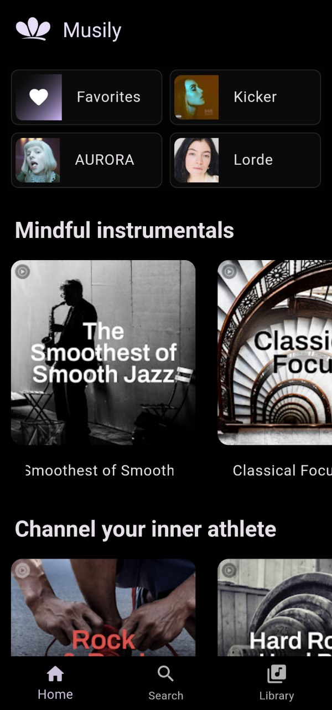
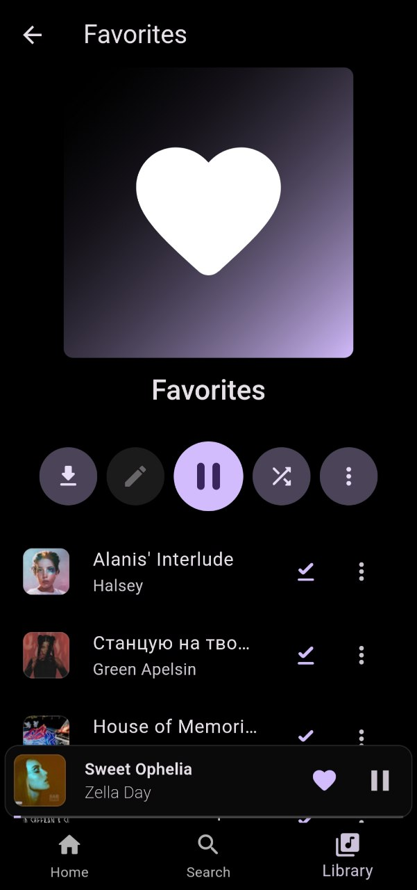

<center>
  
</center>

# Musily: A great music app.

This repository contains the source code for Musily, a music app built with Flutter.

### Download

Get it on [Telegram](https://t.me/MusilyApp).

### Features

- **User-friendly interface:** Musily has an intuitive and easy-to-use interface.
- **Powerful search:** Easily find songs, artists, and albums using our advanced search bar.
- **Offline playback:** Download your favorite songs and listen to them without an internet connection.
- **Library management:** Create and edit custom playlists.

---

### Screenshots

|           |  |  |
| -------------------------------------------------- | ------------------------------------------- | --------------------------------------------- |
|  |     |       |

---

### Technologies

- **Programming Language:** Dart
- **Framework:** Flutter

### Installation

1. **Clone this repository:**

```shell
git clone https://github.com/MusilyApp/musily.git
```

2. **Install dependencies:**

```shell
flutter pub get
```

3. **Run the app:**

```shell
flutte run
```

### Contributions

Contributions are welcome! If you want to contribute to this project, please follow these steps:

1. **Fork this repository.**
2. **Create a new branch for your modification.**
3. **Make your changes and submit a pull request.**

### License

Musily is open-source and licensed under the GNU GENERAL PUBLIC LICENSE. You can find the full license text in the [LICENSE](LICENSE) file.

### Contact

For any questions or suggestions, please contact via [Telegram](https://t.me/FelipeYslaoker) or [E-mail](mailto:musilyapp@gmail.com).
