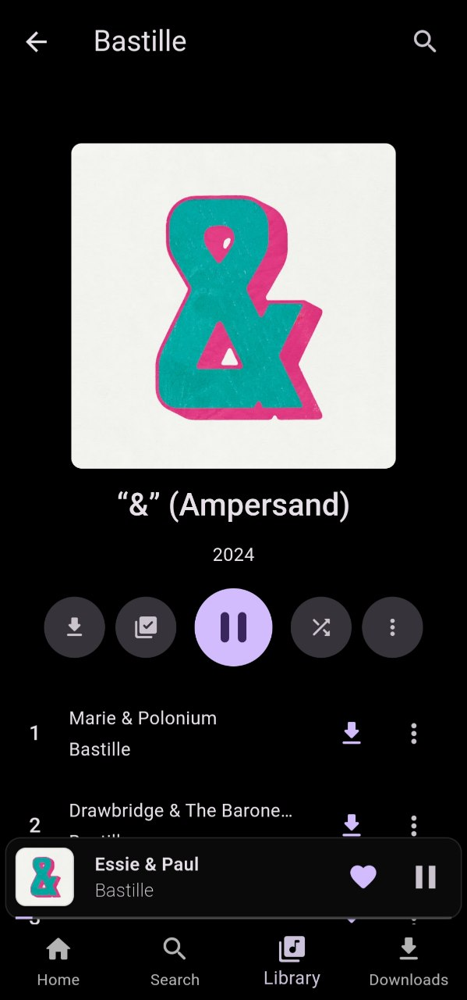

<div align="center">
  
</div>

# Musily: A great music app.

This repository contains the source code for Musily, a music app built with Flutter.

### Download

Get it on [Telegram](https://t.me/MusilyApp).

### Features

- **User-friendly interface:** Musily has an intuitive and easy-to-use interface.
- **Powerful search:** Easily find songs, artists, and albums using our advanced search bar.
- **Offline playback:** Download your favorite songs and listen to them without an internet connection.
- **Library management:** Create and edit custom playlists.

---

### Screenshots

|           |  |  |
| --------------------------------------------------------- | -------------------------------------------------- | ---------------------------------------------------- |
|  |     |       |

---

### Technologies

- **Programming Language:** Dart
- **Framework:** Flutter

---

### Tested On

Musily has been tested and works seamlessly on the following platforms:

- **Flutter SDK**: Version 3.22.3
- **Operating Systems**:
  - **Ubuntu 24.04 LTS** (GNOME)
  - **Nobara Linux 40** (GNOME Edition)

Make sure you have the correct Flutter version and system dependencies installed for an optimal experience.

---

### Linux Support

Musily is compatible with most Linux-based distributions. To ensure the app functions properly, please install the following required dependencies.

**Required Dependencies**:

The following libraries must be installed to run Musily on Linux:

- **libmpv**: For audio playback using MPV media player.
- **libsecret**: For secure storage of user credentials and sensitive information.
- **libjsoncpp**: Required for JSON handling, as a dependency of Flutter Secure Storage.

#### Install Dependencies on Ubuntu/Debian-based Systems

To install these dependencies on Ubuntu or Debian-based systems, use

```bash
sudo apt install libmpv-dev libsecret-1-dev libjsoncpp-dev
```

### Installation on Other Linux Distributions

- **Fedora/RHEL**:

```bash
sudo dnf install mpv-devel libsecret-devel jsoncpp-devel
```

- **Arch/Manjaro**:

```bash
sudo pacman -S mpv libsecret jsoncpp
```

---

### Installation

1. **Clone this repository:**

```shell
git clone https://github.com/MusilyApp/musily.git
```

2. **Install dependencies:**

```shell
flutter pub get
```

3. **Run the app:**

To run Musily with a specific flavor on **Android**, use the following commands:

- **Stable flavor:**

```shell
flutter run --flavor stable
```

- **Dev Flavor**

```shell
flutter run --flavor dev
```

For other platforms, simply use:

```shell
flutter run
```

### Contributions

Contributions are welcome! If you want to contribute to this project, please follow these steps:

1. **Fork this repository.**
2. **Create a new branch for your modification.**
3. **Make your changes and submit a pull request.**

### License

Musily is open-source and licensed under the GNU GENERAL PUBLIC LICENSE. You can find the full license text in the [LICENSE](LICENSE) file.

### Contact

For any questions or suggestions, please contact via [Telegram](https://t.me/FelipeYslaoker) or [E-mail](mailto:contact@musily.app).
